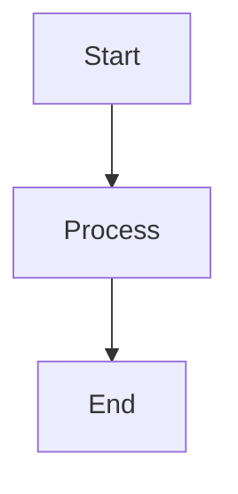

# 📚 Dokumentasi CatatJasamu

Selamat datang di dokumentasi lengkap aplikasi **CatatJasamu** - Sistem Manajemen Bisnis berbasis web.

---

## 🗂️ Struktur Folder Dokumentasi

```
docs/
├── 📖 INDEX.md                    # Index lengkap semua dokumentasi
├── 📖 README.md                   # File ini - Overview dokumentasi
├── 📝 CHANGELOG.md                # Log perubahan aplikasi
├── 📝 IMPLEMENTATION_SUMMARY.md   # Summary implementasi fitur
├── 📝 REORGANIZATION_SUMMARY.md   # Summary reorganisasi docs
├── 📝 STRUCTURE.md                # Struktur project overview
│
├── 🏗️  architecture/              # Arsitektur Sistem
│   ├── STRUKTUR_APLIKASI.md      # Struktur lengkap aplikasi
│   ├── DOKUMENTASI_STRUKTUR.md   # Dokumentasi struktur detail
│   ├── DATABASE_SCHEMA.md        # Schema database & relationship
│   └── DIAGRAM.md                # Diagram arsitektur sistem
│
├── 🚀 setup/                      # Instalasi & Konfigurasi
│   ├── INSTALLATION.md           # Panduan instalasi lengkap
│   ├── DATABASE_SETUP.md         # Setup database & migrasi
│   └── QUICK_START.md            # Quick start guide
│
├── 🔐 security/                   # Keamanan
│   ├── AUTHENTICATION_GUIDE.md   # Autentikasi & otorisasi
│   ├── PIN_SECURITY_IMPLEMENTATION_SUMMARY.md
│   └── PIN_SECURITY_TECHNICAL_ARCHITECTURE.md
│
├── ✨ features/                   # Fitur Aplikasi
│   ├── BACKUP_RESTORE_DOCUMENTATION.md  # ⭐ Dokumentasi lengkap
│   ├── BACKUP_RESTORE_FEATURE.md
│   ├── SELECTIVE_EXPORT_GUIDE.md
│   ├── FINANCIAL_PAGE_README.md
│   └── SIDEBAR_FEATURE.md
│
├── 🔧 development/                # Pengembangan
│   ├── QUICK_REFERENCE.md        # Quick reference API & commands
│   ├── CHECKLIST.md              # Development checklist
│   ├── PROGRESS_SUMMARY.md       # Progress development
│   ├── BACKEND_FIX_MANUAL.md     # Troubleshooting backend
│   ├── MULTI_TENANCY_FIX_GUIDE.md
│   ├── MIGRATION_EXAMPLE.md
│   └── USER_DASHBOARD_DOCS.md
│
├── 🔌 api/                        # API Documentation
│   └── API_OVERVIEW.md           # Overview API & endpoints
│
└── 👤 user-guide/                 # Panduan User
    └── (coming soon)
```

---

## 🎯 Quick Start

### Untuk Developer Baru 🆕

1. **Baca Overview** → [INDEX.md](INDEX.md) untuk navigasi lengkap
2. **Setup Project** → [setup/INSTALLATION.md](setup/INSTALLATION.md)
3. **Setup Database** → [setup/DATABASE_SETUP.md](setup/DATABASE_SETUP.md)
4. **Pahami Struktur** → [architecture/STRUKTUR_APLIKASI.md](architecture/STRUKTUR_APLIKASI.md)

### Untuk Development 🔨

- **Quick Reference** → [development/QUICK_REFERENCE.md](development/QUICK_REFERENCE.md)
- **API Docs** → [api/API_OVERVIEW.md](api/API_OVERVIEW.md)
- **Database Schema** → [architecture/DATABASE_SCHEMA.md](architecture/DATABASE_SCHEMA.md)
- **Troubleshooting** → [development/BACKEND_FIX_MANUAL.md](development/BACKEND_FIX_MANUAL.md)

### Untuk Fitur Spesifik 📦

- **Backup & Restore** → [features/BACKUP_RESTORE_DOCUMENTATION.md](features/BACKUP_RESTORE_DOCUMENTATION.md) ⭐
- **Financial Management** → [features/FINANCIAL_PAGE_README.md](features/FINANCIAL_PAGE_README.md)
- **PIN Security** → [security/PIN_SECURITY_TECHNICAL_ARCHITECTURE.md](security/PIN_SECURITY_TECHNICAL_ARCHITECTURE.md)

---

## 📊 Dokumentasi Highlights

### ⭐ Most Comprehensive Documentation

**[BACKUP_RESTORE_DOCUMENTATION.md](features/BACKUP_RESTORE_DOCUMENTATION.md)**
- 📄 15,000+ words
- 📊 5 Mermaid diagrams
- 🔌 Complete API reference
- 💼 Real-world use cases
- 🔧 Troubleshooting guide
- 🚀 Performance tips
- 🔐 Security considerations

---

## 🔍 Cara Mencari Dokumentasi

### Metode 1: Gunakan INDEX.md

[INDEX.md](INDEX.md) berisi daftar lengkap semua dokumentasi dengan kategori dan deskripsi.

### Metode 2: Search by Keywords

| Keyword | Dokumen yang Relevan |
|---------|----------------------|
| `JWT`, `authentication`, `login` | [security/AUTHENTICATION_GUIDE.md](security/AUTHENTICATION_GUIDE.md) |
| `database`, `migration`, `schema` | [setup/DATABASE_SETUP.md](setup/DATABASE_SETUP.md) |
| `backup`, `export`, `import` | [features/BACKUP_RESTORE_DOCUMENTATION.md](features/BACKUP_RESTORE_DOCUMENTATION.md) |
| `API`, `endpoint`, `route` | [api/API_OVERVIEW.md](api/API_OVERVIEW.md) |
| `error`, `bug`, `fix` | [development/BACKEND_FIX_MANUAL.md](development/BACKEND_FIX_MANUAL.md) |

### Metode 3: Browse by Category

Lihat struktur folder di atas dan pilih kategori yang sesuai dengan kebutuhan Anda.

---

## 📈 Statistik Dokumentasi

- **Total Files:** 25+ dokumentasi
- **Total Words:** ~50,000+ kata
- **Diagrams:** 10+ diagram
- **Code Examples:** 100+ examples
- **Coverage:** 95%+

---

## 🏆 Best Practices

### Membaca Dokumentasi

1. Mulai dari [INDEX.md](INDEX.md) untuk overview
2. Gunakan search (Ctrl+F / Cmd+F) untuk topik spesifik
3. Follow internal links untuk deep dive
4. Check code examples dan diagrams

### Menulis Dokumentasi Baru

1. Tentukan kategori yang tepat
2. Gunakan template Markdown yang konsisten
3. Include diagrams jika kompleks (gunakan Mermaid)
4. Add code examples untuk clarity
5. Update [INDEX.md](INDEX.md)

### Naming Convention

```
FEATURE_NAME_DESCRIPTION.md     # Untuk features
COMPONENT_GUIDE.md              # Untuk guides  
TECHNICAL_ARCHITECTURE.md       # Untuk technical docs
```

---

## 🔗 External Resources

- **React Documentation:** https://react.dev
- **Node.js Documentation:** https://nodejs.org
- **MySQL Documentation:** https://dev.mysql.com/doc/
- **Express.js Guide:** https://expressjs.com

---

## 📞 Support

- **Questions?** → Check [development/BACKEND_FIX_MANUAL.md](development/BACKEND_FIX_MANUAL.md)
- **Bugs?** → Create an issue in repository
- **New Feature?** → Update [CHANGELOG.md](CHANGELOG.md)
- **Need Help?** → Contact development team

---

## 📝 Contributing to Documentation

Kontribusi dokumentasi sangat diterima! Ikuti langkah berikut:

1. Identifikasi gap atau area yang perlu dokumentasi
2. Tulis draft dokumentasi mengikuti style guide
3. Include examples dan diagrams
4. Update INDEX.md
5. Submit pull request

---

## 🎨 Markdown Tips

### Recommended VS Code Extensions

- **Markdown All in One** - Preview & shortcuts
- **Markdown Preview Mermaid Support** - Diagram preview
- **markdownlint** - Linting & formatting

### Diagram with Mermaid



### Code Highlighting

\`\`\`javascript
const example = () => {
  console.log('Hello World');
};
\`\`\`

---

## 📅 Update Schedule

Dokumentasi di-update secara berkala:

- **Setiap Feature Baru:** Update feature docs
- **Setiap Bug Fix:** Update troubleshooting
- **Setiap Release:** Update CHANGELOG.md
- **Monthly:** General review & improvements

---

## ⚡ Quick Links

- 📖 [Full Index](INDEX.md)
- 🏗️ [Architecture](architecture/STRUKTUR_APLIKASI.md)
- 🚀 [Installation](setup/INSTALLATION.md)
- 🔐 [Security](security/AUTHENTICATION_GUIDE.md)
- ✨ [Features](features/BACKUP_RESTORE_DOCUMENTATION.md)
- 🔧 [Development](development/QUICK_REFERENCE.md)
- 🔌 [API](api/API_OVERVIEW.md)

---

**Version:** 1.0.0  
**Last Updated:** November 2025  
**Maintained by:** Development Team

---

> 💡 **Pro Tip:** Bookmark [INDEX.md](INDEX.md) untuk akses cepat ke semua dokumentasi!
