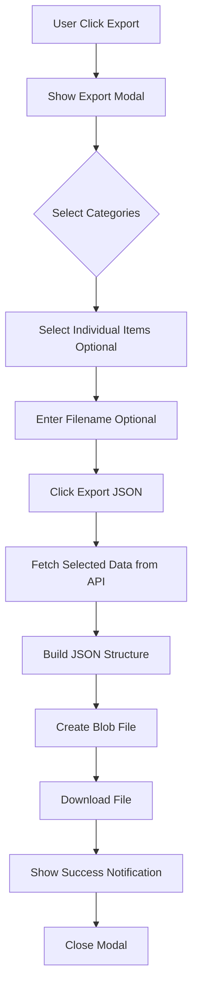
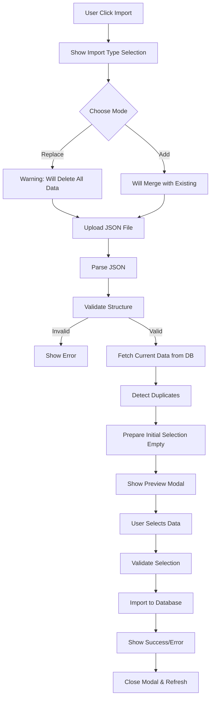
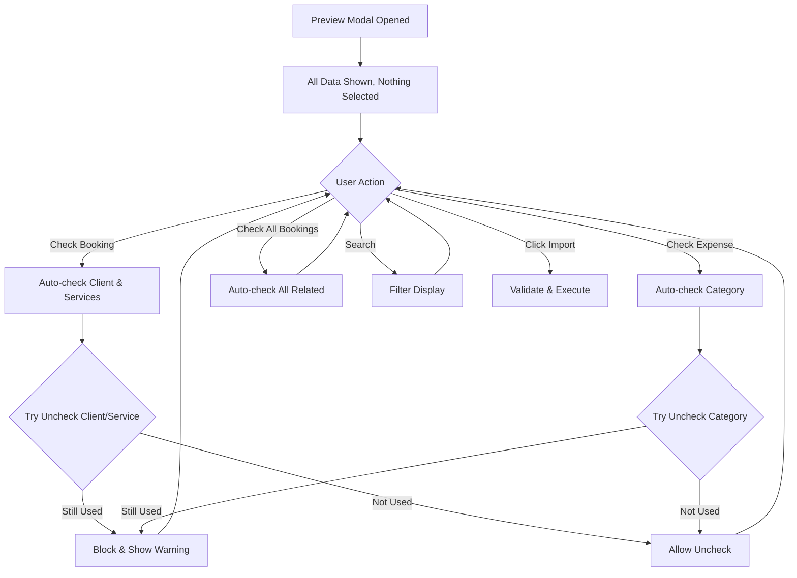
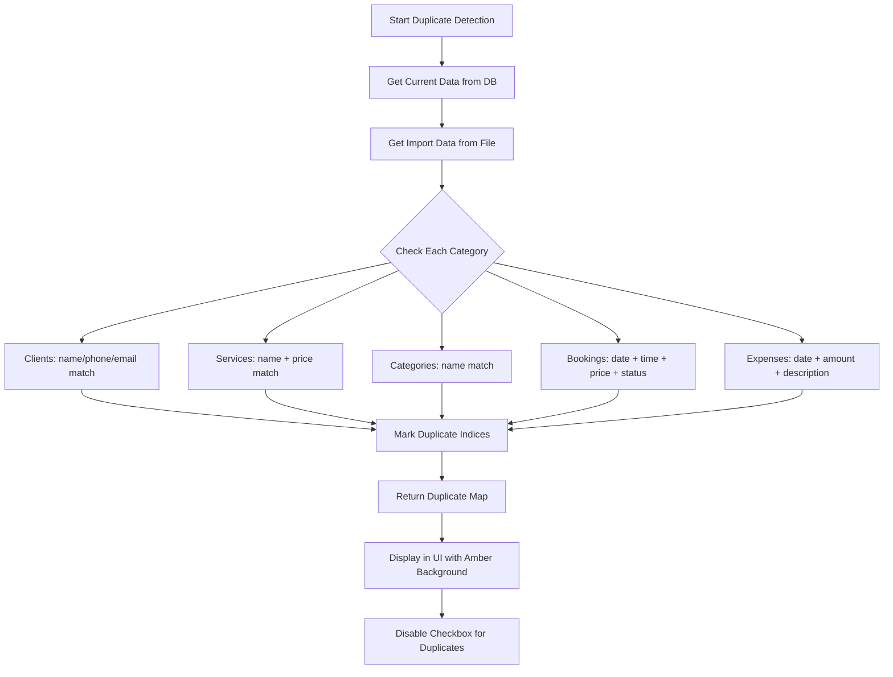
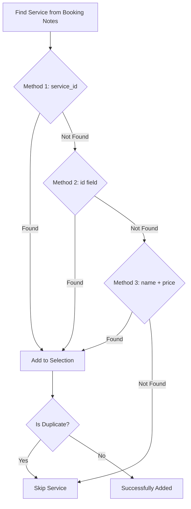

# 📦 Dokumentasi Lengkap: Backup & Restore System

## 📋 Daftar Isi

1. [Overview](#overview)
2. [Arsitektur System](#arsitektur-system)
3. [Fitur Utama](#fitur-utama)
4. [Diagram Alur](#diagram-alur)
5. [Struktur Data](#struktur-data)
6. [Logika Bisnis](#logika-bisnis)
7. [Validasi & Integritas Data](#validasi--integritas-data)
8. [API Reference](#api-reference)
9. [Use Cases](#use-cases)
10. [Troubleshooting](#troubleshooting)

---

## 🎯 Overview

### Deskripsi
Sistem Backup & Restore adalah fitur untuk melakukan **export** dan **import** data aplikasi dalam format JSON. Fitur ini memungkinkan user untuk:
- Backup semua data bisnis (klien, layanan, booking, pembayaran, pengeluaran)
- Transfer data antar akun/perusahaan
- Restore data dengan validasi duplicate
- Selective import dengan preview lengkap

### Tujuan
1. **Data Portability**: Memindahkan data antar environment
2. **Data Integrity**: Menjaga konsistensi relasi antar data
3. **User Control**: Memberikan kontrol penuh kepada user untuk memilih data yang diimport
4. **Duplicate Prevention**: Mencegah duplikasi data yang sudah ada

---

## 🏗️ Arsitektur System

### High-Level Architecture

```
┌─────────────────────────────────────────────────────────────┐
│                     BACKUP & RESTORE SYSTEM                  │
├─────────────────────────────────────────────────────────────┤
│                                                               │
│  ┌───────────────┐         ┌────────────────┐              │
│  │  EXPORT       │         │   IMPORT       │              │
│  │  WORKFLOW     │         │   WORKFLOW     │              │
│  └───────┬───────┘         └────────┬───────┘              │
│          │                          │                       │
│          ▼                          ▼                       │
│  ┌───────────────┐         ┌────────────────┐              │
│  │ Data Selection│         │ File Upload    │              │
│  │ & Export      │         │ & Validation   │              │
│  └───────┬───────┘         └────────┬───────┘              │
│          │                          │                       │
│          ▼                          ▼                       │
│  ┌───────────────┐         ┌────────────────┐              │
│  │ Generate JSON │         │ Detect         │              │
│  │ Blob File     │         │ Duplicates     │              │
│  └───────┬───────┘         └────────┬───────┘              │
│          │                          │                       │
│          ▼                          ▼                       │
│  ┌───────────────┐         ┌────────────────┐              │
│  │ Download File │         │ Preview Modal  │              │
│  └───────────────┘         │ with Selection │              │
│                            └────────┬───────┘              │
│                                     │                       │
│                                     ▼                       │
│                            ┌────────────────┐              │
│                            │ Import Selected│              │
│                            │ Data to DB     │              │
│                            └────────────────┘              │
│                                                               │
└─────────────────────────────────────────────────────────────┘
```

### Component Architecture

```
BackupDataPage.jsx
├── State Management
│   ├── importData (parsed JSON)
│   ├── importSelection (selected indices)
│   ├── duplicateData (duplicate indices)
│   └── notification (feedback messages)
│
├── Export Functions
│   ├── handleExportJSON()
│   ├── handleShowExportModal()
│   └── fetchAllData()
│
├── Import Functions
│   ├── handleFileSelect()
│   ├── detectDuplicates()
│   ├── prepareImportSelection()
│   └── handleConfirmImport()
│
├── Selection Logic
│   ├── handleToggleImportItem()
│   ├── handleToggleAllImport()
│   └── Auto-selection & Validation
│
└── UI Components
    ├── Export Modal
    ├── Import Preview Modal
    └── Notification System
```

---

## 🚀 Fitur Utama

### 1. **Export Data (Backup)**

#### Fitur:
- ✅ Export semua data dalam 1 file JSON
- ✅ Selective export per kategori
- ✅ Custom filename
- ✅ Include/exclude default categories
- ✅ Support relational data (bookings with payments, expenses with categories)

#### Kategori Data yang Dapat Di-Export:
1. **Company Settings** - Pengaturan perusahaan
2. **Clients** - Data klien/customer
3. **Services** - Data layanan
4. **Bookings & Payments** - Data booking dan pembayarannya
5. **Expenses** - Data pengeluaran
6. **Expense Categories** - Kategori pengeluaran (termasuk default)

---

### 2. **Import Data (Restore)**

#### Fitur:
- ✅ Upload file JSON backup
- ✅ Automatic duplicate detection
- ✅ Preview modal dengan semua data
- ✅ Search & filter dalam setiap kategori
- ✅ Selective import dengan checkbox
- ✅ Auto-selection untuk related data
- ✅ Validation untuk menjaga integritas data

#### Mode Import:
1. **Replace Mode** - Hapus semua data lama, import data baru
2. **Add Mode** - Tambahkan data baru ke data yang sudah ada

---

### 3. **Duplicate Detection System**

#### Algoritma Deteksi:

```javascript
// CLIENTS - Detect by name/phone/email
clients.some(c => 
  c.name === item.name || 
  c.phone === item.phone || 
  c.email === item.email
)

// SERVICES - Detect by name + price
services.some(s => 
  s.name === item.name && 
  parseFloat(s.price) === parseFloat(item.price)
)

// EXPENSE CATEGORIES - Detect by name
categories.some(cat => 
  cat.name === item.name
)

// BOOKINGS - Detect by date + time + price + status
bookings.some(b => 
  b.booking_date === item.booking_date &&
  b.booking_time === item.booking_time &&
  parseFloat(b.total_price) === parseFloat(item.total_price) &&
  b.status === item.status
)

// EXPENSES - Detect by date + amount + description
expenses.some(e => 
  e.expense_date === item.expense_date &&
  parseFloat(e.amount) === parseFloat(item.amount) &&
  e.description === item.description
)
```

---

### 4. **Auto-Selection & Data Integrity**

#### Konsep:
Ketika user memilih data yang **dependent** (seperti booking atau expense), sistem otomatis memilih data **dependency** (seperti client, service, atau category) untuk menjaga integritas relational data.

#### Relasi Data:

```
BOOKING → CLIENT (many-to-one)
       → SERVICES (many-to-many via notes.services)

EXPENSE → EXPENSE_CATEGORY (many-to-one)
```

#### Logika Auto-Selection:

##### A. Single Item Selection
```javascript
// Ketika user centang 1 booking:
handleToggleImportItem('bookings', index) {
  // 1. Centang booking
  selection.bookings.push(index);
  
  // 2. Auto-centang client terkait (jika bukan duplicate)
  const booking = importData.bookings[index];
  const clientIndex = findClient(booking.client_id);
  if (!isDuplicate(clientIndex)) {
    selection.clients.push(clientIndex);
  }
  
  // 3. Auto-centang SEMUA services terkait (jika bukan duplicate)
  const notes = JSON.parse(booking.notes);
  notes.services.forEach(service => {
    const serviceIndex = findService(service.service_id);
    if (!isDuplicate(serviceIndex)) {
      selection.services.push(serviceIndex);
    }
  });
}
```

##### B. Bulk Selection
```javascript
// Ketika user klik "Pilih Semua Booking":
handleToggleAllImport('bookings', true) {
  // 1. Centang semua bookings (non-duplicate)
  selection.bookings = [...allNonDuplicateIndices];
  
  // 2. Kumpulkan semua client IDs unik
  const clientIndices = new Set();
  bookings.forEach(booking => {
    const clientIndex = findClient(booking.client_id);
    if (!isDuplicate(clientIndex)) {
      clientIndices.add(clientIndex);
    }
  });
  
  // 3. Kumpulkan semua service IDs unik
  const serviceIndices = new Set();
  bookings.forEach(booking => {
    const notes = JSON.parse(booking.notes);
    notes.services.forEach(service => {
      const serviceIndex = findService(service.service_id);
      if (!isDuplicate(serviceIndex)) {
        serviceIndices.add(serviceIndex);
      }
    });
  });
  
  // 4. Auto-centang semua yang ditemukan
  selection.clients = [...clientIndices];
  selection.services = [...serviceIndices];
}
```

---

### 5. **Uncheck Prevention System**

#### Konsep:
User TIDAK BOLEH menghilangkan centang pada data dependency jika masih ada data dependent yang tercentang.

#### Implementasi:

##### A. Single Item Uncheck Protection
```javascript
// Ketika user coba uncentang client/service:
handleToggleImportItem('clients', index) {
  // Cek apakah ada booking yang masih checked menggunakan client ini
  const selectedBookings = selection.bookings;
  const isStillUsed = selectedBookings.some(bookingIdx => {
    const booking = importData.bookings[bookingIdx];
    return booking.client_id === importData.clients[index].id;
  });
  
  if (isStillUsed) {
    // BLOKIR uncheck!
    showNotification('warning', 
      'Klien masih digunakan oleh booking yang dipilih. ' +
      'Hapus centang booking terlebih dahulu.'
    );
    return; // Jangan ubah selection
  }
  
  // Jika tidak dipakai, boleh uncheck
  selection.clients = selection.clients.filter(i => i !== index);
}
```

##### B. Bulk Uncheck Protection
```javascript
// Ketika user klik "Pilih Semua Client" untuk uncheck:
handleToggleAllImport('clients', false) {
  const selectedBookings = selection.bookings;
  
  if (selectedBookings.length > 0) {
    // Kumpulkan client indices yang masih dipakai
    const protectedIndices = new Set();
    selectedBookings.forEach(bookingIdx => {
      const booking = importData.bookings[bookingIdx];
      const clientIdx = findClient(booking.client_id);
      if (clientIdx !== -1) {
        protectedIndices.add(clientIdx);
      }
    });
    
    // Jangan uncheck yang masih dipakai
    selection.clients = [...protectedIndices];
    
    showNotification('warning', 
      `${protectedIndices.size} klien masih digunakan oleh booking.`
    );
  } else {
    // Boleh uncheck semua jika tidak ada booking yang checked
    selection.clients = [];
  }
}
```

---

## 📊 Diagram Alur

### 1. Export Workflow



### 2. Import Workflow (Main Flow)



### 3. Import Preview Modal Interaction



### 4. Duplicate Detection Flow



### 5. Service Matching Algorithm (Triple Method)



---

## 📦 Struktur Data

### Export JSON Structure

```json
{
  "metadata": {
    "version": "1.0",
    "exportedAt": "2025-02-11T09:04:00.000Z",
    "exportedBy": "user_id_4",
    "dataCategories": ["clients", "services", "bookings", "payments", "expenses", "expenseCategories"]
  },
  "companySettings": {
    "id": 4,
    "company_name": "PT Antam Event Organizer",
    "address": "Jl. Sudirman No. 123",
    "phone": "021-12345678",
    "email": "info@antam.com",
    "logo_url": "/uploads/logo.png"
  },
  "clients": [
    {
      "id": 1,
      "name": "PT Antam",
      "phone": "628978647452",
      "email": "antam@example.com",
      "address": "Jakarta",
      "notes": "VIP Client"
    }
  ],
  "services": [
    {
      "id": 10,
      "name": "Full Band 1",
      "description": "Band lengkap untuk acara besar",
      "price": "3000000.00",
      "category": "Entertainment",
      "is_active": true
    },
    {
      "id": 11,
      "name": "Sound 7000 watt",
      "price": "2500000.00"
    },
    {
      "id": 12,
      "name": "Genset 30 KVA",
      "price": "2000000.00"
    }
  ],
  "bookings": [
    {
      "id": 45,
      "client_id": 1,
      "service_id": 10,
      "booking_date": "2025-02-11",
      "booking_time": "09:04:00",
      "event_date": "2025-02-15",
      "location": "Grand Ballroom Hotel Mulia",
      "total_price": "14760000.00",
      "down_payment": "5000000.00",
      "status": "confirmed",
      "notes": "{\"services\":[{\"service_id\":\"10\",\"service_name\":\"Full Band 1\",\"custom_price\":3000000},{\"service_id\":\"11\",\"service_name\":\"Sound 7000 watt\",\"custom_price\":2500000},{\"service_id\":\"12\",\"service_name\":\"Genset 30 KVA\",\"custom_price\":2000000}],\"additional_info\":\"Setup at 6 AM\"}"
    }
  ],
  "payments": [
    {
      "id": 101,
      "booking_id": 45,
      "amount": "5000000.00",
      "payment_date": "2025-02-11",
      "payment_method": "transfer",
      "status": "completed"
    }
  ],
  "expenses": [
    {
      "id": 201,
      "category_id": 5,
      "description": "Sewa Gedung Bulan Februari",
      "amount": "5000000.00",
      "expense_date": "2025-02-01",
      "payment_method": "transfer",
      "receipt_url": "/uploads/receipts/feb-2025.pdf"
    }
  ],
  "expenseCategories": [
    {
      "id": 1,
      "name": "Operasional",
      "description": "Biaya operasional harian",
      "color": "#3B82F6",
      "icon": "settings",
      "user_id": null
    },
    {
      "id": 5,
      "name": "Sewa",
      "user_id": 4
    }
  ]
}
```

---

## 🧠 Logika Bisnis

### 1. Data Dependency Rules

#### Rule 1: Booking Dependencies
```
BOOKING harus memiliki:
  - CLIENT (mandatory via client_id)
  - SERVICE(S) (mandatory via notes.services)
  
Ketika import booking:
  ✓ Client harus ada di database atau diimport bersamaan
  ✓ Semua services harus ada di database atau diimport bersamaan
  ✗ Booking tidak boleh diimport tanpa client
  ✗ Booking tidak boleh diimport tanpa services
```

#### Rule 2: Expense Dependencies
```
EXPENSE harus memiliki:
  - EXPENSE_CATEGORY (mandatory via category_id)
  
Ketika import expense:
  ✓ Category harus ada di database atau diimport bersamaan
  ✗ Expense tidak boleh diimport tanpa category
```

#### Rule 3: Payment Dependencies
```
PAYMENT terkait dengan:
  - BOOKING (via booking_id)
  
Catatan: Payment tidak perlu validasi karena akan otomatis
         diimport jika booking-nya diimport
```

---

### 2. Service Matching Algorithm

#### Problem:
Booking menyimpan multiple services dalam field `notes` (JSON). Service ID di notes bisa berbeda tipe data dengan ID di database.

#### Solution: Triple-Method Matching

```javascript
function findService(serviceFromNotes, availableServices) {
  let serviceIndex = -1;
  
  // METHOD 1: Match by service_id (with type conversion)
  if (serviceFromNotes.service_id) {
    const serviceId = typeof serviceFromNotes.service_id === 'string' 
      ? parseInt(serviceFromNotes.service_id) 
      : serviceFromNotes.service_id;
    
    serviceIndex = availableServices.findIndex(s => s.id === serviceId);
    if (serviceIndex !== -1) return serviceIndex;
  }
  
  // METHOD 2: Match by id field (with type conversion)
  if (serviceFromNotes.id) {
    const serviceId = typeof serviceFromNotes.id === 'string' 
      ? parseInt(serviceFromNotes.id) 
      : serviceFromNotes.id;
    
    serviceIndex = availableServices.findIndex(s => s.id === serviceId);
    if (serviceIndex !== -1) return serviceIndex;
  }
  
  // METHOD 3: Match by name + price (fallback)
  if (serviceFromNotes.service_name) {
    const price = serviceFromNotes.custom_price || serviceFromNotes.price || 0;
    
    serviceIndex = availableServices.findIndex(s => 
      s.name === serviceFromNotes.service_name && 
      parseFloat(s.price) === parseFloat(price)
    );
    if (serviceIndex !== -1) return serviceIndex;
  }
  
  return -1; // Not found
}
```

#### Why Triple Method?

| Method | Use Case | Reliability |
|--------|----------|-------------|
| **Method 1** | ID cocok, tipe data cocok | ⭐⭐⭐⭐⭐ |
| **Method 2** | ID cocok tapi field berbeda | ⭐⭐⭐⭐ |
| **Method 3** | ID tidak cocok, match by business logic | ⭐⭐⭐ |

---

### 3. State Management Strategy

#### State Structure:
```javascript
const [importData, setImportData] = useState(null);
// Berisi parsed JSON dari file upload
// Structure: { clients: [], services: [], bookings: [], ... }

const [duplicateData, setDuplicateData] = useState({});
// Berisi indices dari data duplicate
// Structure: { clients: [0, 2], services: [1], ... }

const [importSelection, setImportSelection] = useState({});
// Berisi indices dari data yang dipilih user
// Structure: { clients: [1, 3], services: [0, 2], ... }

const [importSearchTerms, setImportSearchTerms] = useState({});
// Berisi search query untuk filter
// Structure: { clients: 'antam', services: 'band', ... }
```

#### State Update Flow:
```
User Action → handleToggleImportItem() 
           → Validation Check
           → Auto-selection Logic
           → Update importSelection State
           → UI Re-render
```

---

## 🔒 Validasi & Integritas Data

### 1. File Upload Validation

```javascript
const validateBackupFile = (file) => {
  // Check file type
  if (!file.name.endsWith('.json')) {
    throw new Error('File harus berformat .json');
  }
  
  // Check file size (max 10MB)
  if (file.size > 10 * 1024 * 1024) {
    throw new Error('File terlalu besar (max 10MB)');
  }
  
  // Parse and validate structure
  const data = JSON.parse(fileContent);
  
  if (!data.metadata || !data.metadata.version) {
    throw new Error('File backup tidak valid (missing metadata)');
  }
  
  // Validate required fields
  const requiredCategories = ['clients', 'services', 'bookings', 'expenses'];
  requiredCategories.forEach(category => {
    if (!Array.isArray(data[category])) {
      throw new Error(`Invalid structure: ${category} must be an array`);
    }
  });
  
  return true;
};
```

---

### 2. Import Validation

```javascript
const validateImportSelection = (selection, importData, duplicateData) => {
  const errors = [];
  
  // Validate bookings have required dependencies
  if (selection.bookings && selection.bookings.length > 0) {
    selection.bookings.forEach(bookingIdx => {
      const booking = importData.bookings[bookingIdx];
      
      // Check client
      if (booking.client_id) {
        const clientIndex = importData.clients.findIndex(c => c.id === booking.client_id);
        const isClientSelected = selection.clients?.includes(clientIndex);
        const isClientDuplicate = duplicateData.clients?.includes(clientIndex);
        
        if (!isClientSelected && !isClientDuplicate) {
          errors.push(`Booking tanggal ${booking.booking_date} memerlukan client yang belum dipilih`);
        }
      }
      
      // Check services
      if (booking.notes) {
        const notes = JSON.parse(booking.notes);
        if (notes.services) {
          notes.services.forEach(service => {
            const serviceIndex = findServiceIndex(service, importData.services);
            const isServiceSelected = selection.services?.includes(serviceIndex);
            const isServiceDuplicate = duplicateData.services?.includes(serviceIndex);
            
            if (!isServiceSelected && !isServiceDuplicate) {
              errors.push(`Booking tanggal ${booking.booking_date} memerlukan service "${service.service_name}" yang belum dipilih`);
            }
          });
        }
      }
    });
  }
  
  // Validate expenses have required category
  if (selection.expenses && selection.expenses.length > 0) {
    selection.expenses.forEach(expenseIdx => {
      const expense = importData.expenses[expenseIdx];
      
      if (expense.category_id) {
        const categoryIndex = importData.expenseCategories.findIndex(c => c.id === expense.category_id);
        const isCategorySelected = selection.expenseCategories?.includes(categoryIndex);
        const isCategoryDuplicate = duplicateData.expenseCategories?.includes(categoryIndex);
        
        if (!isCategorySelected && !isCategoryDuplicate) {
          errors.push(`Expense "${expense.description}" memerlukan kategori yang belum dipilih`);
        }
      }
    });
  }
  
  return {
    valid: errors.length === 0,
    errors
  };
};
```

---

## 🔌 API Reference

### 1. Export Endpoint

#### GET `/api/backup/download-json`

**Query Parameters:**
```
companySettings: boolean
clients: boolean
services: boolean
bookings: boolean
payments: boolean
expenses: boolean
expenseCategories: boolean

clientsIds: JSON string array of selected IDs (optional)
servicesIds: JSON string array of selected IDs (optional)
bookingsIds: JSON string array of selected IDs (optional)
expensesIds: JSON string array of selected IDs (optional)
expenseCategoriesIds: JSON string array of selected IDs (optional)
```

**Response:**
```json
{
  "metadata": { ... },
  "companySettings": { ... },
  "clients": [ ... ],
  "services": [ ... ],
  "bookings": [ ... ],
  "payments": [ ... ],
  "expenses": [ ... ],
  "expenseCategories": [ ... ]
}
```

**Example Request:**
```javascript
const params = new URLSearchParams({
  companySettings: true,
  clients: true,
  services: true,
  bookings: true,
  payments: true,
  expenses: false,
  expenseCategories: false,
  clientsIds: JSON.stringify([1, 2, 3]),
  bookingsIds: JSON.stringify([45, 46])
});

const response = await api.get(`/backup/download-json?${params}`);
```

---

### 2. Import Endpoint

#### POST `/api/backup/import`

**Request Body:**
```json
{
  "mode": "add",
  "data": {
    "companySettings": { ... },
    "clients": [ ... ],
    "services": [ ... ],
    "bookings": [ ... ],
    "payments": [ ... ],
    "expenses": [ ... ],
    "expenseCategories": [ ... ]
  }
}
```

**Response:**
```json
{
  "success": true,
  "message": "Data berhasil diimport",
  "imported": {
    "clients": 5,
    "services": 10,
    "bookings": 3,
    "payments": 8,
    "expenses": 12,
    "expenseCategories": 4
  }
}
```

---

### 3. Get Current Data Endpoint

#### GET `/api/backup/current-data`

**Response:**
```json
{
  "clients": [ ... ],
  "services": [ ... ],
  "bookings": [ ... ],
  "expenses": [ ... ],
  "expenseCategories": [ ... ]
}
```

**Purpose:** Digunakan untuk detect duplicates dengan membandingkan data yang akan diimport dengan data yang sudah ada di database.

---

## 💼 Use Cases

### Use Case 1: Backup Data Sebelum Maintenance

**Actor:** Admin/Owner

**Scenario:**
1. Admin akan melakukan maintenance database
2. Admin ingin backup semua data sebagai precaution
3. Admin membuka halaman Backup & Restore
4. Admin klik "Export Data"
5. Admin centang semua kategori
6. Admin klik "Export JSON"
7. File `backup-2025-02-11.json` terdownload
8. Admin simpan file di tempat aman
9. Maintenance dilakukan
10. Jika ada masalah, admin bisa restore dari backup

**Expected Result:** ✅ Semua data ter-backup dalam 1 file JSON

---

### Use Case 2: Transfer Data ke Akun Baru

**Actor:** User yang Pindah Akun

**Scenario:**
1. User punya akun lama (user_id: 4) dengan banyak data
2. User buat akun baru (user_id: 2) untuk perusahaan baru
3. User ingin transfer beberapa client & service ke akun baru
4. Di akun lama:
   - Export data (pilih client & service tertentu)
   - Download file JSON
5. Di akun baru:
   - Import file JSON
   - Mode: "Add" (tambahkan ke data existing)
   - Preview modal muncul
   - Pilih data yang ingin diimport
   - Klik "Import Data"
6. Data berhasil ditransfer

**Expected Result:** ✅ Data terpilih berhasil di-copy ke akun baru

---

### Use Case 3: Import dengan Duplicate Prevention

**Actor:** User Import Data dari Partner

**Scenario:**
1. User terima file backup dari partner bisnis
2. User upload file untuk import
3. System detect ada 5 client duplicate (sudah ada di DB)
4. Preview modal menampilkan:
   - 10 clients total
   - 5 clients duplicate (amber background, disabled checkbox)
   - 5 clients baru (bisa dipilih)
5. User pilih 3 dari 5 clients baru
6. User import
7. Hanya 3 clients baru yang masuk ke database
8. 5 duplicate clients diabaikan

**Expected Result:** ✅ Tidak ada data duplicate, database tetap bersih

---

### Use Case 4: Import Booking dengan Auto-Selection

**Actor:** User Import Event Data

**Scenario:**
1. User import file berisi booking event
2. Preview modal terbuka (semua kosong, tidak ada yang tercentang)
3. User centang 1 booking "PT Antam Event"
4. System otomatis centang:
   - Client "PT Antam"
   - Service "Full Band 1"
   - Service "Sound 7000 watt"
   - Service "Genset 30 KVA"
5. User coba uncentang "Genset 30 KVA"
6. System blokir dengan warning: "Layanan masih digunakan oleh booking"
7. User harus uncentang booking dulu
8. Setelah uncentang booking, baru bisa uncentang services
9. User centang kembali booking dan import semuanya
10. Data masuk dengan relasi lengkap

**Expected Result:** ✅ Data relational terimport dengan benar, integritas terjaga

---

## 🔧 Troubleshooting

### Problem 1: File Upload Gagal

**Symptom:**
```
Error: File tidak valid atau rusak
```

**Diagnosis:**
- File bukan format JSON
- JSON structure tidak sesuai
- File corrupted

**Solution:**
```javascript
// Validate JSON structure
try {
  const data = JSON.parse(fileContent);
  console.log('JSON valid:', data);
} catch (e) {
  console.error('JSON parse error:', e);
  // Re-export dari source asli
}
```

---

### Problem 2: Service Tidak Terdeteksi (Semua Services Tidak Tercentang)

**Symptom:**
```
Check booking, hanya client yang tercentang
Services tetap kosong
```

**Diagnosis:**
- service_id di notes tidak cocok dengan ID di importData
- Type mismatch (string vs number)
- Field name berbeda (price vs custom_price)

**Solution:**
```javascript
// Debug di console
console.log('Service dari notes:', service);
console.log('Available services:', importData.services);
console.log('Service ID type:', typeof service.service_id);
console.log('Service price field:', service.custom_price || service.price);

// Triple method matching akan handle ini
```

---

### Problem 3: Duplicate Detection Terlalu Aggressive

**Symptom:**
```
Client "PT ABC" marked as duplicate
Padahal phone/email berbeda
```

**Diagnosis:**
- Duplicate detection check name OR phone OR email
- Mungkin nama sama tapi beda perusahaan

**Solution:**
```javascript
// Modify detection logic to use AND instead of OR
// OR (saat ini):
const isDuplicate = existingClients.some(c => 
  c.name === newClient.name || 
  c.phone === newClient.phone || 
  c.email === newClient.email
);

// AND (alternatif):
const isDuplicate = existingClients.some(c => 
  c.name === newClient.name && 
  c.phone === newClient.phone && 
  c.email === newClient.email
);
```

---

### Problem 4: Import Stuck di Loading

**Symptom:**
```
Click "Import Data"
Loading spinner forever
No error message
```

**Diagnosis:**
- API timeout
- Data terlalu besar
- Network issue

**Solution:**
```javascript
// Add timeout handler
const importWithTimeout = async (data) => {
  const timeout = new Promise((_, reject) => 
    setTimeout(() => reject(new Error('Import timeout')), 30000)
  );
  
  const importRequest = api.post('/backup/import', data);
  
  return Promise.race([importRequest, timeout]);
};
```

---

### Problem 5: Relational Data Tidak Konsisten Setelah Import

**Symptom:**
```
Booking ter-import tapi client-nya tidak ada
Foreign key constraint error
```

**Diagnosis:**
- Client di-skip karena duplicate
- Tapi booking yang depend on client tetap diimport
- Auto-selection tidak jalan

**Solution:**
```javascript
// Tambahkan final validation sebelum import
const validateRelations = (selection, importData, duplicateData) => {
  selection.bookings.forEach(bookingIdx => {
    const booking = importData.bookings[bookingIdx];
    const clientIndex = findClient(booking.client_id);
    
    const clientWillBeImported = selection.clients.includes(clientIndex);
    const clientIsDuplicate = duplicateData.clients.includes(clientIndex);
    
    if (!clientWillBeImported && !clientIsDuplicate) {
      throw new Error(`Booking requires client that won't be imported`);
    }
  });
};
```

---

## 📈 Performance Considerations

### 1. Large File Handling

**Problem:** File backup besar (>5MB) lambat di-parse dan di-render

**Solution:**
```javascript
// Chunked processing for large arrays
const processLargeArray = (array, processor, chunkSize = 100) => {
  return new Promise((resolve) => {
    let index = 0;
    
    const processChunk = () => {
      const chunk = array.slice(index, index + chunkSize);
      chunk.forEach(processor);
      
      index += chunkSize;
      
      if (index < array.length) {
        setTimeout(processChunk, 0); // Next chunk
      } else {
        resolve();
      }
    };
    
    processChunk();
  });
};

// Usage
await processLargeArray(importData.bookings, (booking) => {
  // Process each booking
});
```

---

### 2. Optimized Search & Filter

**Problem:** Search lambat dengan dataset besar (>1000 items)

**Solution:**
```javascript
// Debounced search
import { debounce } from 'lodash';

const debouncedSearch = debounce((query, category) => {
  setImportSearchTerms(prev => ({
    ...prev,
    [category]: query
  }));
}, 300);

// Memoized filter
const filteredItems = useMemo(() => {
  return getFilteredImportItems(category);
}, [category, importSearchTerms, importData]);
```

---

### 3. Virtual Scrolling for Long Lists

**Problem:** Render 1000+ items di dropdown menyebabkan lag

**Solution:**
```javascript
// Use react-window or react-virtualized
import { FixedSizeList } from 'react-window';

<FixedSizeList
  height={400}
  itemCount={filteredItems.length}
  itemSize={50}
  width="100%"
>
  {({ index, style }) => (
    <div style={style}>
      <Checkbox value={filteredItems[index]} />
    </div>
  )}
</FixedSizeList>
```

---

## 🎨 UI/UX Best Practices

### 1. Visual Feedback

```javascript
// Loading states
<Button disabled={loading}>
  {loading ? (
    <>
      <Spinner className="mr-2" />
      Importing...
    </>
  ) : (
    'Import Data'
  )}
</Button>

// Progress indicator
<Progress value={importProgress} max={100} />
<Text>{importProgress}% Complete</Text>
```

---

### 2. Error Handling

```javascript
// User-friendly error messages
const handleError = (error) => {
  let message = 'Terjadi kesalahan';
  
  if (error.response?.status === 413) {
    message = 'File terlalu besar. Maksimal 10MB';
  } else if (error.response?.status === 400) {
    message = 'Format file tidak valid';
  } else if (error.message.includes('timeout')) {
    message = 'Import memakan waktu terlalu lama. Coba lagi.';
  }
  
  showNotification('error', message);
};
```

---

### 3. Confirmation Dialogs

```javascript
// Prevent accidental actions
const handleReplaceImport = () => {
  if (!confirm('PERINGATAN: Semua data akan dihapus! Lanjutkan?')) {
    return;
  }
  
  executeImport('replace');
};
```

---

## 🔐 Security Considerations

### 1. File Content Validation

```javascript
// Sanitize data before import
const sanitizeData = (data) => {
  // Remove script tags
  const cleanString = (str) => {
    return str.replace(/<script\b[^<]*(?:(?!<\/script>)<[^<]*)*<\/script>/gi, '');
  };
  
  // Sanitize each field
  data.clients = data.clients.map(client => ({
    ...client,
    name: cleanString(client.name),
    email: cleanString(client.email),
    notes: cleanString(client.notes)
  }));
  
  return data;
};
```

---

### 2. Rate Limiting

```javascript
// Prevent abuse
let lastImportTime = 0;
const IMPORT_COOLDOWN = 60000; // 1 minute

const handleImport = () => {
  const now = Date.now();
  if (now - lastImportTime < IMPORT_COOLDOWN) {
    showNotification('warning', 'Please wait 1 minute between imports');
    return;
  }
  
  lastImportTime = now;
  executeImport();
};
```

---

### 3. User Permission Check

```javascript
// Only admin/owner can import
const canImport = user.role === 'admin' || user.role === 'owner';

if (!canImport) {
  showNotification('error', 'Anda tidak memiliki akses untuk import data');
  return;
}
```

---

## 📝 Testing Checklist

### Unit Tests

- [ ] `detectDuplicates()` correctly identifies duplicates
- [ ] `prepareImportSelection()` returns empty selection
- [ ] `getFilteredImportItems()` filters by search term
- [ ] Service matching (triple method) works for all cases
- [ ] Auto-selection adds correct related data
- [ ] Uncheck validation blocks when necessary

### Integration Tests

- [ ] Export API returns correct data structure
- [ ] Import API accepts and processes data
- [ ] Duplicate detection queries database correctly
- [ ] Relations maintained after import

### E2E Tests

- [ ] User can export data successfully
- [ ] User can import data with preview
- [ ] Duplicate items are marked correctly
- [ ] Auto-selection works for bookings
- [ ] Auto-selection works for expenses
- [ ] Uncheck prevention works
- [ ] Search/filter works in preview
- [ ] Error handling shows user-friendly messages

---

## 🚀 Future Enhancements

### 1. Incremental Import
Allow importing data in batches to handle very large datasets.

### 2. Conflict Resolution UI
Show side-by-side comparison when duplicate is detected, let user choose which to keep.

### 3. Import History
Track all import activities with timestamp, user, and data summary.

### 4. Scheduled Backups
Auto-export data daily/weekly/monthly.

### 5. Cloud Backup Integration
Upload backup files to Google Drive, Dropbox, etc.

### 6. Diff View
Show what changed between backup file and current data before import.

### 7. Rollback Feature
Undo import if something went wrong.

---

## 📚 References

- [JSON Schema Validation](https://json-schema.org/)
- [React State Management Best Practices](https://react.dev/learn/managing-state)
- [Data Migration Strategies](https://martinfowler.com/articles/evodb.html)
- [Duplicate Detection Algorithms](https://en.wikipedia.org/wiki/Record_linkage)

---

## 👥 Contributors

- **Developer:** [Your Name]
- **Last Updated:** February 11, 2025
- **Version:** 1.0.0

---

## 📄 License

This documentation is part of CatatJasamu project.
© 2025 All Rights Reserved.
